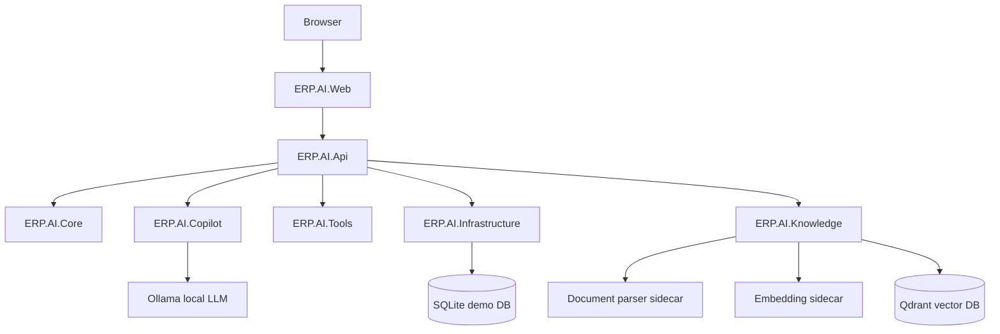

# ERP AI Copilot

Open-source ERP AI Copilot built on .NET 8, ASP.NET Core, EF Core SQLite, Ollama, Qdrant, and local Python sidecars for document parsing and embeddings.

The project is designed as a local-first ERP assistant:

- Safe read-only ERP tool calling for receivables, revenue, inventory, and project budget checks.
- Knowledge ingestion for PDF, DOCX, TXT, and Markdown documents.
- Semantic search with local multilingual embeddings and Qdrant.
- Grounded RAG answers with source citations and no LLM call when retrieval has no usable evidence.
- Docker Compose stack for API, Web UI, Ollama, Qdrant, document parser, and embedding service.

## Project Status

| Area | Status | Notes |
| --- | --- | --- |
| ERP read-only copilot | Done | Uses safe C# tools; write actions are blocked. |
| Document ingestion | Done | Stores metadata/chunks in SQLite and files on local storage. |
| Semantic search | Done | Uses BAAI/bge-m3 embeddings and Qdrant. |
| Grounded RAG | Done | Includes citation validation and no-evidence refusal path. |
| Production auth | Not implemented | Current user and permission services are mocks. |
| Write actions | Not implemented | Requires human-in-the-loop approval workflow before enabling. |

Current milestone: Phase 2.3, grounded Knowledge RAG with source citations.

## Quick Start

### Option A: Run prebuilt release images

```bash
docker compose -f docker-compose.release.yml up -d
```

### Option B: Build locally from source

```bash
docker compose up -d --build
```

The first run can take time because Ollama and the embedding service need to download models.

## Local Development

Prerequisites:

- .NET SDK 8.x
- Docker Desktop
- PowerShell 7 or Windows PowerShell

Restore, build, and test:

```bash
dotnet restore ERP.AI.sln
dotnet build ERP.AI.sln --configuration Release
dotnet test ERP.AI.sln --configuration Release --no-build --verbosity normal
```

Run only the .NET API locally:

```bash
dotnet run --project src/ERP.AI.Api/ERP.AI.Api.csproj
```

Run only the Web UI locally:

```bash
dotnet run --project src/ERP.AI.Web/ERP.AI.Web.csproj
```

For the full AI/RAG flow, prefer Docker Compose because the API depends on Ollama, Qdrant, the document parser, and the embedding service.

## Endpoints

| Service | URL |
| --- | --- |
| Web UI | http://localhost:5001 |
| API Swagger | http://localhost:5000/swagger |
| API liveness | http://localhost:5000/health |
| API readiness | http://localhost:5000/health/ready |
| Document parser health | http://localhost:8000/health |
| Embedding service health | http://localhost:8010/health |
| Qdrant REST API | http://localhost:6333 |
| Ollama API | http://localhost:11434 |

## Main Commands

| Command | Description |
| --- | --- |
| `dotnet restore ERP.AI.sln` | Restore .NET dependencies. |
| `dotnet build ERP.AI.sln --configuration Release` | Build all .NET projects. |
| `dotnet test ERP.AI.sln --configuration Release --no-build` | Run unit tests after build. |
| `docker compose up -d --build` | Build and start the local full stack. |
| `docker compose -f docker-compose.release.yml up -d` | Start from GHCR release images. |
| `./scripts/docker-smoke.ps1` | Start the stack and verify core health endpoints. |
| `docker compose down` | Stop the local stack. |
| `docker compose logs -f api` | Follow API logs. |

## Architecture



Project layout:

| Path | Purpose |
| --- | --- |
| `src/ERP.AI.Api` | ASP.NET Core Web API, controllers, middleware, DI wiring. |
| `src/ERP.AI.Web` | Static Web UI and proxy controllers. |
| `src/ERP.AI.Core` | Shared entities, DTOs, and interfaces. |
| `src/ERP.AI.Infrastructure` | EF Core SQLite repositories and demo data seed. |
| `src/ERP.AI.Tools` | Safe read-only ERP tool definitions. |
| `src/ERP.AI.Copilot` | LLM provider, prompt manager, and tool orchestration. |
| `src/ERP.AI.Knowledge` | Document ingestion, chunking, vector search, and RAG services. |
| `services/document-parser` | Python FastAPI document parsing sidecar. |
| `services/embedding-service` | Python FastAPI local embedding sidecar. |
| `tests` | Offline unit tests for core, tools, copilot, and knowledge flows. |

## Knowledge RAG Flow

1. Upload a document through the Knowledge UI or API.
2. The API extracts text through the document parser sidecar.
3. The document is chunked and stored with metadata.
4. Chunks are embedded through the local embedding service.
5. Vectors are stored in Qdrant.
6. A user asks a question.
7. Semantic search retrieves relevant chunks.
8. If evidence is below the threshold, the LLM is not called.
9. If evidence is strong enough, the local LLM answers using explicit source blocks.
10. Citation IDs are validated before the response is returned.

Example:

```bash
curl -X POST http://localhost:5000/api/knowledge/ask \
  -H "Content-Type: application/json" \
  -d "{\"question\":\"When an invoice is overdue by 14 days, what should Finance do?\"}"
```

## Configuration

Common environment variables:

| Variable | Default | Purpose |
| --- | --- | --- |
| `OLLAMA_MODEL` | `qwen3` | Local LLM model pulled by Ollama. |
| `EMBEDDING_MODEL` | `BAAI/bge-m3` | Sentence transformer model for embeddings. |
| `API_PORT` | `5000` | Host port for API in release compose. |
| `WEB_PORT` | `5001` | Host port for Web UI in release compose. |
| `RAG_TOP_K` | `6` | Number of chunks requested for RAG retrieval. |
| `RAG_MIN_SCORE` | `0.35` | Minimum similarity score for usable evidence. |
| `RAG_MAX_SOURCES` | `5` | Maximum cited sources in an answer. |
| `RAG_MAX_CONTEXT_CHARACTERS` | `14000` | Max context size sent to the LLM. |
| `RAG_MAX_CHUNK_CHARACTERS` | `3500` | Max characters per source chunk. |
| `RAG_MAX_CONVERSATION_TURNS` | `6` | Follow-up context window size. |
| `RAG_TEMPERATURE` | `0.1` | Low-temperature grounded answer generation. |

See `.env.example` for the default local values.

## Smoke Test

After changing Docker, health checks, or runtime wiring, run:

```powershell
./scripts/docker-smoke.ps1
```

For release images:

```powershell
./scripts/docker-smoke.ps1 -ComposeFile docker-compose.release.yml -SkipBuild
```

## Security Model

The current project is local-first and demo-oriented:

- LLM access is local through Ollama.
- ERP tools are read-only.
- The LLM never receives direct database access.
- Document content is treated as untrusted evidence.
- No-evidence RAG responses do not call the LLM.
- API auth is not production-ready; `MockCurrentUser` and `MockErpPermissionService` are placeholders.
- Permissive local CORS is enabled for development and should be tightened before production use.

Do not expose this stack to the public internet without replacing mock auth, tightening CORS, adding real authorization policies, and reviewing storage/network boundaries.

## Progress Log

See `docs/PROGRESS.md` for the current implementation and verification snapshot.

## License

MIT. See `LICENSE`.
